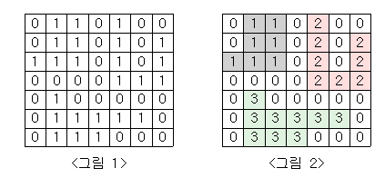

# [BOJ] 단지번호붙이기 (Silver-1)

> .

[문제링크](https://www.acmicpc.net/problem/2667)

## 1. 문제 설명


### 1.1 문제요약

1. 

   다음과 같은 형태로 배열이 주어진다. 1은 집이 있다는 것이고 0은 집이 없다는 것이다.

2. 집이 상하좌우로 연결되어있으면 같은 단지로 취급한다. 단, 대각선은 연결되어있다고 생각하지 않는다.

3. 지도를 입력하여 단지수를 출력하고, 각 단지에 속하는 집의 수를 오름차순으로 출력하시오.

### 1.2 입출력 예시

- 입력

  ```python
  7
  0110100
  0110101
  1110101
  0000111
  0100000
  0111110
  0111000
  ```
  
- 출력

  ```python
  3
  7
  8
  9
  ```
  
  

## 2. 문제해결 아이디어


### 1) 문제의 핵심


#### (1) 그래프 탐색 알고리즘의 응용

1. 먼저, 배열을 처음부터 확인하며 집이 있는지 없는지 확인한다.
2. 다음으로, 집이 있다면 해당 집과 연결된 집을 모두 탐색하고 카운트한다.
3. '1'과 '2'의 과정을 계속 진행하여 배열의 모든 수를 돌았을 때, 더이상 탐색할 집이 없으면 멈춘다.


* 자세한 설명은 코드 주석을 확인하세요.